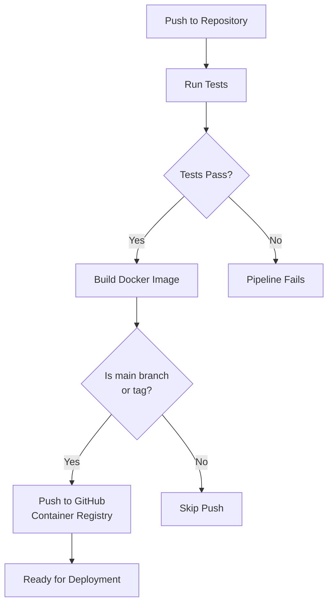

# Shopping List API

A RESTful API service for managing shopping lists built with Go. This service provides endpoints to create, read, update, and delete shopping list items, with data persistence in MySQL.

## Features

- RESTful API endpoints for shopping list management
- MySQL database integration
- Docker containerization
- GitHub Actions CI/CD pipeline
- Health check endpoint
- Environment-based configuration

## Tech Stack

- Go 1.21.5
- MySQL
- Docker & Docker Compose
- GitHub Actions
- Gorilla Mux (HTTP router)

## API Endpoints

| Method | Endpoint | Description |
|--------|----------|-------------|
| GET    | /items   | Get all shopping list items |
| GET    | /items/{id} | Get a specific item |
| POST   | /items   | Create a new item |
| PUT    | /items/{id} | Update an existing item |
| DELETE | /items/{id} | Delete an item |
| GET    | /health  | Health check endpoint |

## Prerequisites

- Go 1.21.5 or higher
- Docker and Docker Compose
- MySQL

## Environment Variables

Create a `.env` file in the root directory with the following variables:

```env
DB_USER=root
DB_PASSWORD=password
DB_HOST=mysql
DB_NAME=shopping_list
ENV=development
```

## Local Development

1. Clone the repository:
```bash
git clone https://github.com/your-username/shopping-list-api.git
```

2. Start the database and API using Docker Compose:
```bash
docker-compose up
```

3. For local development without Docker:
```bash
go mod download
go run main.go
```

## Testing

Run the test suite:
```bash
go test -v ./...
```

## CI/CD Pipeline

The project uses GitHub Actions for continuous integration and deployment. The pipeline includes:



### Pipeline Steps:
1. **Test Stage**
   - Runs on every push and pull request
   - Sets up Go environment
   - Executes unit tests

2. **Build and Push Stage**
   - Builds Docker image
   - Pushes to GitHub Container Registry (only for main branch and tags)
   - Tags images with:
     - Branch name
     - PR number (for pull requests)
     - Semantic version (for tags)
     - Git SHA

## Docker Support

The application can be containerized using the provided `Dockerfile` and `docker-compose.yml`. The Docker setup includes:
- Multi-stage builds for smaller final images
- Wait-for-db script to handle database initialization
- Development and production configurations

## Contributing

1. Fork the repository
2. Create your feature branch (`git checkout -b feature/amazing-feature`)
3. Commit your changes (`git commit -m 'Add some amazing feature'`)
4. Push to the branch (`git push origin feature/amazing-feature`)
5. Open a Pull Request

## License

This project is licensed under the MIT License - see the LICENSE file for details.
